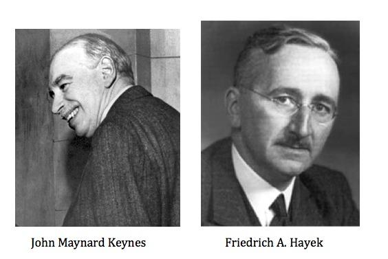
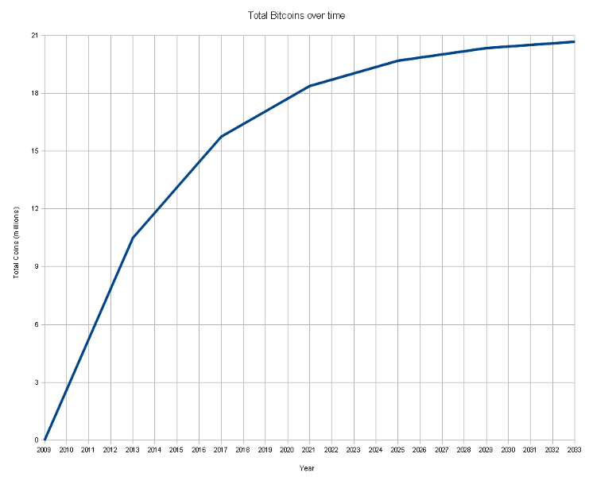

!SLIDE

# Bitcoin

!SLIDE bullets incremental
# Over mij

* Bèr `berkes` Kessels
* @berkes - http://berk.es
* Webdeveloper, geen econoom.

!SLIDE bullets incremental
# Deze presentatie

* Staat online [http://berk.es/bitcoin-presentatie/](berk.es/bitcoin-presentatie/)
* Is opensource (MIT) [github.com/berkes/bitcoin-presentatie](http://github.com/berkes/bitcoin-presentatie)
* Heeft "vraagmomenten" van 5 mins.
* Is niet getest; qua tijd. Graag iedere 20 mins een seintje?

!SLIDE bullets
# Overzicht

* Introductie
* Geschiedenis
* Basis
** Decentraal, Peer to Peer
** Mining, Cryptografie

!SLIDE bullets incremental
# Cryptografie
* HASH?

!SLIDE center

!SLIDE center

!SLIDE bullets incremental
# Economie
* Hayek?

!SLIDE center

!SLIDE center

!SLIDE center

!SLIDE bullets incremental
# Beveiliging

* Moest ik niet ergens drie keer op kloppen?
* Gewoon, NortonCleanSweepDeluxe--==CRAcK3DByL33t==-- draaien.
* Yubykey hangt aan mijn sleutelbos, private keys liggen thuis in de kluis.

!SLIDE center
# Achtergrond

!SLIDE smaller

Bitcoin is een *experimentele* vorm van *elektronisch geld*, [...] (welke) naar een ander persoon (kan) worden verzonden *via het internet* door *iedereen met een Bitcoinadres*.

In tegenstelling tot de meeste valuta is Bitcoin niet afhankelijk van het vertrouwen in een *centrale uitgevende instelling*. Dit elektronische geld maakt gebruik van een database verspreid over knooppunten van een *peer-to-peer*-netwerk om transacties te journaliseren, en maakt gebruik van *cryptografie* om te voorzien in de nodige beveiliging, zoals dat Bitcoins alleen kunnen worden uitgegeven door de persoon die er eigenaar van is, en nooit meer dan één keer uitgegeven kan worden door die eigenaar.
[bron: Wikipedia](http://nl.wikipedia.org/wiki/Bitcoin) en [bitcoin wiki](https://en.bitcoin.it/wiki/Main_Page)

!SLIDE
# Video #

[Video](http://embedded-video.guardianapps.co.uk/?a=false&amp;u=/technology/video/2013/apr/26/bitcoin-currency-moves-offline-berlin-video)

!SLIDE center
# Vragen

!SLIDE center
# Historie

!SLIDE bullets incremental
* [3 jan 2009](blockexplorer.com/block/000000000019d6689c085ae165831e934ff763ae46a2a6c172b3f1b60a8ce26f)
* [Satoshi Nakomoto](http://www.mail-archive.com/search?l=cryptography@metzdowd.com&q=from:%22Satoshi+Nakamoto%2)
 mailde een whitepaper.
* Satoshi is anoniem, pseudoniem.
* Verscheen in het nieuws rondom SilkRoad

!SLIDE bullets incremental
* Kreeg momentum, en tech-sites schreven erover.
* Eerste Wisselkoers bubble.
* MTgox-inbraak. BTC zelf niet gehacked.
* Maanden stabiel rond €8

!SLIDE bullets incremental
* Professionalisering van aanbod
* Verbreding van aanbod
* Cyprus; aandacht op alle grote nieuwsoutlets.
* Boem! €210 per Bitcoin

!SLIDE center
# Vragen

!SLIDE center
# Decentraal, Peer-to-peer

!SLIDE small
De peer-to-peertopologie van Bitcoin en het ontbreken van centrale administratie maakt het praktisch onmogelijk voor een overheid, of ieder ander, om de waarde van Bitcoins te manipuleren of meer inflatie te induceren dan er van tevoren is vastgelegd. Het ontwerp zorgt voor anoniem eigendom en overdracht van waarde.
[bron: Wikipedia](http://nl.wikipedia.org/wiki/Bitcoin)

!SLIDE bullets incremental
* Groot, openbaar kasboek.
* Houdt precies bij welke wallets welke coins hebben.
* En van waar naar waar die coins (of fracties daarvan) gaan.
* Anoniem?

!SLIDE center
# Mining

!SLIDE bullets incremental
* Blok, volgorde en juistheid transacties
* Keten, lijst van blokken

!SLIDE bullets incremental
* Verificatie van block en volgorde.
* Berekenen van de hashes van blocks.
* Eerste die een berekening met het block kan oplossen, wint.
* Krijgt reward (nu 25 BTC).

!SLIDE bullets incremental
* Meerderheid van het netwerk moet accoord gaan met hash
* Meerderheid moet accoord gaan met block
* X moeten accoord gaan met transactie

!SLIDE bullets incremental
* Netwerk tracht iedere 10 minuten block te laten vinden.
* Halveert iedere 210.000 BTC tot totaal 21 million.
* Hashing power aanpasbaar.

!SLIDE center
# Vragen

!SLIDE center
# Economie

!SLIDE center

## Totale marktwaarde
## Deflatie versus Inflatie

!SLIDE center
# Vragen
